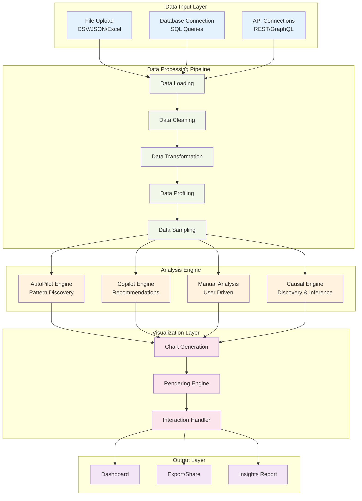
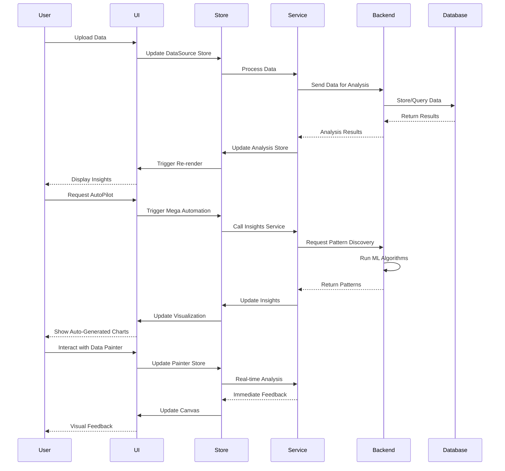
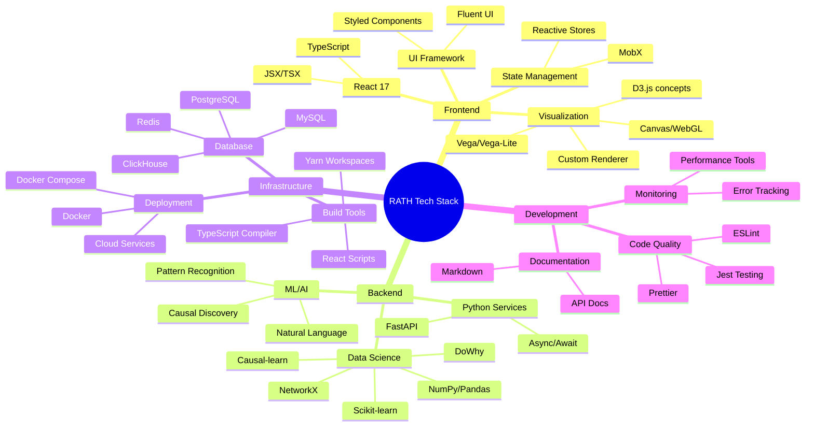
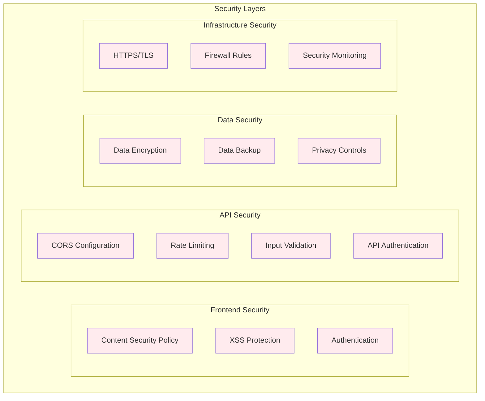
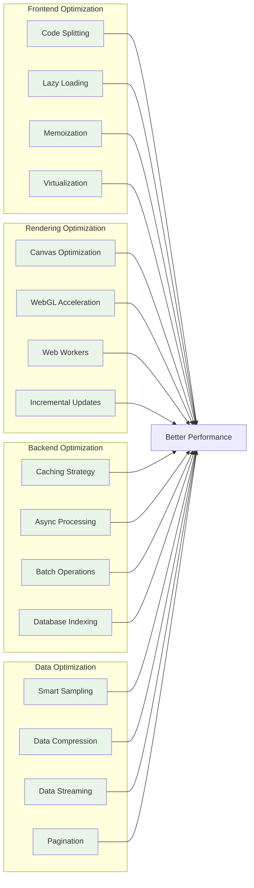

# RATH Technical Architecture

## System Architecture Diagram

```mermaid
graph TB
    subgraph "Frontend (React + TypeScript)"
        UI[User Interface]
        subgraph "Core Components"
            NAV[App Navigation]
            DS[Data Source]
            DC[Data Connection]
            MA[Mega Automation]
            SA[Semi Automation]
            MC[Manual Control]
            DP[Data Painter]
            DB[Dashboard]
            CA[Causal Analysis]
        end
        
        subgraph "State Management (MobX)"
            CS[Common Store]
            DSS[DataSource Store]
            MAS[MegaAuto Store]
            PS[Painter Store]
            DBS[Dashboard Store]
            CAS[Causal Store]
        end
        
        subgraph "Services & Utils"
            API[API Services]
            UTILS[Utilities]
            WORKERS[Web Workers]
        end
        
        subgraph "Visualization Engine"
            VR[Vega Renderer]
            VS[Vega Scenegraph]
            GW[Graphic Walker]
            CANVAS[Canvas/WebGL]
        end
    end
    
    subgraph "Backend Services (Microservices)"
        subgraph "Python Services"
            CAUSAL[Causal Service<br/>FastAPI + Algorithms]
            NARRATIVE[Narrative Service<br/>NLP + GPT]
            PREDICTION[Prediction Service<br/>ML Models]
            PATTERN[Text Pattern Service<br/>Text Analysis]
        end
        
        subgraph "Data Layer"
            CONNECTOR[Connector Service<br/>Database Abstraction]
            subgraph "Databases"
                POSTGRES[(PostgreSQL)]
                MYSQL[(MySQL)]
                CLICKHOUSE[(ClickHouse)]
                ATHENA[(Amazon Athena)]
                REDIS[(Redis Cache)]
            end
        end
    end
    
    subgraph "External Services"
        GPT[OpenAI GPT]
        CLOUD[Cloud Storage]
        CDN[CDN]
    end
    
    %% Connections
    UI --> NAV
    UI --> DS
    UI --> DC
    UI --> MA
    UI --> SA
    UI --> MC
    UI --> DP
    UI --> DB
    UI --> CA
    
    DS --> DSS
    MA --> MAS
    DP --> PS
    DB --> DBS
    CA --> CAS
    
    MA --> API
    SA --> API
    CA --> API
    DP --> API
    
    API --> CAUSAL
    API --> NARRATIVE
    API --> PREDICTION
    API --> PATTERN
    API --> CONNECTOR
    
    CONNECTOR --> POSTGRES
    CONNECTOR --> MYSQL
    CONNECTOR --> CLICKHOUSE
    CONNECTOR --> ATHENA
    
    VR --> CANVAS
    VS --> VR
    GW --> VS
    
    NARRATIVE --> GPT
    
    CAUSAL --> REDIS
    PREDICTION --> REDIS
    
    UI --> CDN
    
    classDef frontend fill:#e1f5fe
    classDef backend fill:#f3e5f5
    classDef database fill:#e8f5e8
    classDef external fill:#fff3e0
    
    class UI,NAV,DS,DC,MA,SA,MC,DP,DB,CA,CS,DSS,MAS,PS,DBS,CAS,API,UTILS,WORKERS,VR,VS,GW,CANVAS frontend
    class CAUSAL,NARRATIVE,PREDICTION,PATTERN,CONNECTOR backend
    class POSTGRES,MYSQL,CLICKHOUSE,ATHENA,REDIS database
    class GPT,CLOUD,CDN external
```

## Data Flow Architecture

## Component Interaction Diagram

## Technology Stack Detail

## Security Architecture

## Performance Optimization Strategy

This technical architecture documentation provides a comprehensive view of how RATH is structured and how its components interact with each other. The diagrams illustrate the system's complexity and the thoughtful design that enables its powerful data analysis capabilities.